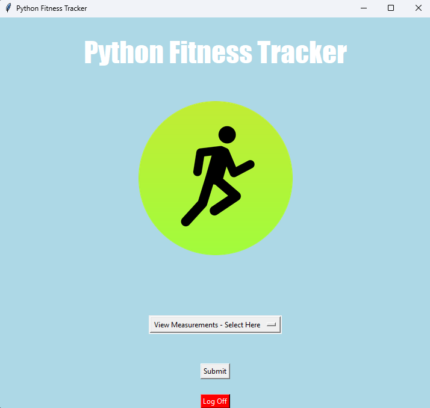
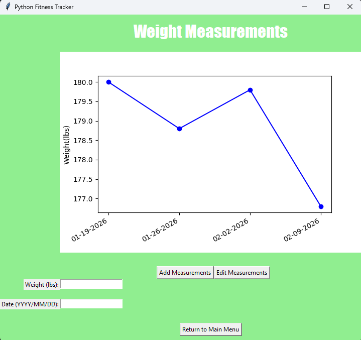

<h1>Python Fitness Tracker</h1>

This is a project combining Python programming with SQL implemention in order to construct a fitness application where the user can track their progress. TKinter is primarily used to display and navigate the app, while SQLite implements the use of SQL databases.

## Main Menu

  

The program launches in a new window. Greeting the user with the main page, it displays the name, options list, submit button, and log off button.
Description of each widgets
* **View Measurements - Select Here**

   This is where the user can select where they want to navigate to next. Currently there are 2 options: Weight Measurements or Waist Circumference Measurements. Currently only Weight works as an option but others will be implemented as features are developed.
   
* **Submit Button**
   
   This button is used once the user has made a selection.

* **Log Off Button**

   This button is used to close the program. Essentially another way to close the window.

## Weight Measurements

  

In this screen, the user can add and see their information regarding their weight over specific dates. Still a WIP, but the idea is there. Only Add Measurements works for now.

* **View Measurements - Select Here**

   This is where the user can select where they want to navigate to next. Currently there are 2 options: Weight Measurements or Waist Circumference Measurements. Currently only Weight works as an option but others will be implemented as features are developed.
   
* **Submit Button**
   
   This button is used once the user has made a selection.

* **Log Off Button**

   This button is used to close the program. Essentially another way to close the window.

