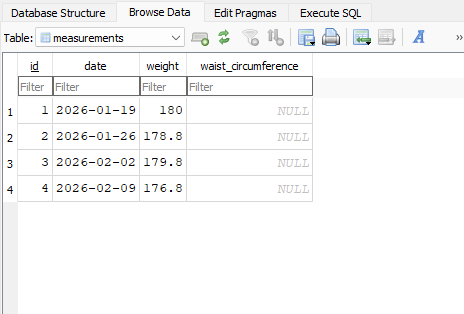

<h1>Python Fitness Tracker</h1>

This is a project combining Python programming with SQL implemention in order to construct a fitness application where the user can track their progress. TKinter is primarily used to display and navigate the app, while SQLite implements the use of SQL databases.

## Main Menu

  

The program launches in a new window. Greeting the user with the main page, it displays the name, options list, submit button, and log off button.
Description of each widgets
* **View Measurements - Select Here**

   This is where the user can select where they want to navigate to next. Currently there are 2 options: Weight Measurements or Waist Circumference Measurements. Currently only Weight works as an option but others will be implemented as features are developed.
   
* **Submit Button**
   
   This button is used once the user has made a selection.

* **Log Off Button**

   This button is used to close the program. Essentially another way to close the window.

## Weight Measurements

  

In this screen, the user can add and see their information regarding their weight over specific dates. Still a WIP, but the idea is there. Only Add Measurements works for now.

* **Graph**

   This graph displays the user's progress based on the information they submitted. The plotted points make it easier to see which points of data were used. Currently only displays based on the data that was previously entered, dynamic refresh display still in development.

* **Edit Measurements Button**

   This button will let the user edit an entry if they need to, currently in development.
   
* **Add Measurements Button**
   
   This button will let the user enter a new entry based on the values entered in the Weight and Date fields. The weight must be a number in pounds (lbs) and the date in (YYYY/MM/DD) format. The entry fields are currently also displayed on this menu, but there are some ideas to turn these into sub menus.

* **Return to Main Menu Button**

   This button is used to go back to the main menu screen.

## Measurements.db

  

This file is the database where all the information is stored. The program reads and writes the data using the SQLite which involve functions and methods I developed involving SQL queries. Currently dates, weight measurements, and waist circumference measurements are stored. Circumferences are NULL do to no implementation for that option, but will be added soon. Possible new additions could be stored in the future if planned out accordingly.
